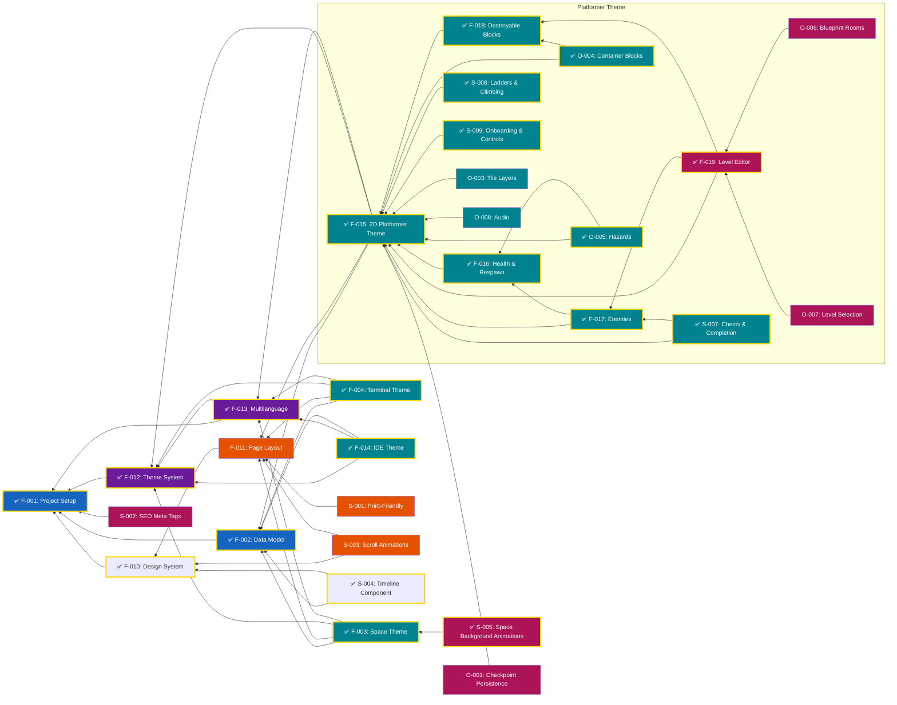

# Feature List

## Features

### Core (Must Have)

- [x] F-001: Project setup — Vite + React + TypeScript scaffold, Tailwind, shadcn/ui, docs
- [x] F-002: Data model — TypeScript types + JSON files for CV content
- [x] F-003: Space theme — floating panels, parallax depth, scroll-through spatial effect, all CV sections
- [x] F-004: Terminal theme — CRT green phosphor, scanlines, command-line interaction, `:help`, all CV sections
- [x] F-010: Design system — typography, spacing, colors, component tokens
- [ ] F-011: Page layout — section arrangement, scrolling structure, navigation
- [x] F-012: Theme system — Preact Signals, `createLocalStorageSignal`, theme switcher infrastructure
- [x] F-013: Multilanguage — i18n EN/DE, locale signal, UI translations, CV data per locale
- [x] F-014: IDE theme — file tree sidebar, tab bar, syntax-highlighted editor, status bar, all CV sections
- [x] **F-015** **2D Platformer Theme** — Playable side-scrolling level: movement, physics, terrain, one-way bridges, camera follow, coins revealing CV facts, and the journal that collects them
- [x] **F-016** **Platformer Health & Respawn** — Three-heart HUD, pit-fall damage with return to safe ground, respawn at full health keeping collected facts
- [x] **F-017** **Platformer Enemies** — Green and purple slimes: patrol, stomp-to-defeat, side-contact damage, key drops, spike cooldown
- [x] **F-018** **Platformer Destroyable Blocks** — Crates, question-mark blocks and rocks, hit from below, each with its own reveal outcome
- [x] **F-019** **Platformer Level Editor** — Dev-only grid tool for authoring level layouts with real game sprites, with a level dropdown and save-to-JSON

### Should Have

- [ ] S-001: Print-friendly styling — `@media print` so CV doubles as printable resume
- [ ] S-002: SEO meta tags — Open Graph metadata for social media previews
- [ ] S-003: Scroll animations — subtle reveal animations as sections scroll into view
- [~] S-004: Reusable timeline component — shared by all themes with timeline data (implemented in IDE theme as `TimelineSection`, not yet extracted as theme-agnostic)

- [x] **S-005** **Space Background Animations** — Scroll-driven background animations (spaceship, planets, shooting stars, asteroids) add atmosphere to the Space theme
- [x] **S-007** **Platformer Chests & Level Completion** — Key-gated chests holding Experience facts; opening every one shows the Thank-You screen with contact info
- [x] **S-008** **Platformer Ladders & Climbing** — Ladder and chain tiles, climb physics, and vertical camera follow
- [x] **S-009** **Platformer Onboarding & Controls** — Controls overlay that fades on first movement, contextual hint signs, pause when the floating controls open

### Optional

- [ ] **O-001** **Checkpoint Persistence** — Saves collected facts and spawn position at each checkpoint, persisting across theme switches so the player can continue later
- [~] **O-003** **Platformer Tile Layers** — Ground autotiling, decorative background layer, foreground decoration tiles, sky and water bands (pattern-repeat tool and a visual-clarity rework still open)
- [x] **O-004** **Platformer Container Blocks** — Coin pot and potion pot, both broken by landing on top, dropping a coin and a healing heart
- [x] **O-005** **Platformer Hazards** — Spike tiles that cost half a heart on touch, with no knockback and no stomp defeat
- [~] **O-006** **Platformer Blueprint Rooms** — Authoring reusable rooms on a second editor canvas, saved to a library and placed with an overlap-checked preview (connection points still open)
- [ ] **O-007** **Platformer Level Selection** — Visitor-facing level choice and `?level=` URL loading, instead of always loading `main`
- [ ] **O-008** **Platformer Audio** — Background music and sound effects, muted by default (not committed)

- _TBD_

---

## Implementation Status

| #     | Feature                | Status         | Spec                                    | Implementation | Tests |
| ----- | ---------------------- | -------------- | --------------------------------------- | -------------- | ----- |
| F-001 | Project setup          | ✅ Done        | [spec](../specs/F-001-project-setup/spec.md) | ✅             | ✅    |
| F-002 | Data model             | ✅ Done        | [spec](../specs/F-002-data-model/spec.md) | ✅             | ✅    |
| F-003 | Space theme            | ✅ Done        | [spec](../specs/F-003-space-theme/spec.md) | ✅             | ✅    |
| F-004 | Terminal theme         | ✅ Done        | [spec](../specs/F-004-terminal-theme/spec.md) | ✅             | ✅    |
| F-010 | Design system          | ✅ Done        | [spec](../specs/F-010-design-system/spec.md) | ✅             | ✅    |
| F-011 | Page layout            | 📋 Planned     | —                                       | ❌             | ❌    |
| F-012 | Theme system           | ✅ Done        | —                                       | ✅             | ✅    |
| F-013 | Multilanguage          | ✅ Done        | [spec](../specs/F-013-multilanguage/spec.md) | ✅             | ✅    |
| F-014 | IDE theme              | ✅ Done        | [spec](../specs/F-014-ide-theme/spec.md) | ✅             | ✅    |
| F-015 | 2D Platformer theme    | ✅ Done        | [spec](../specs/F-015-platformer-theme/spec.md) | ✅ | ✅ |
| F-016 | Platformer health & respawn | ✅ Done   | [spec](../specs/F-016-platformer-health/spec.md) | ✅ | ✅ |
| F-017 | Platformer enemies     | ✅ Done        | [spec](../specs/F-017-platformer-enemies/spec.md) | ✅ | ✅ |
| F-018 | Platformer destroyable blocks | ✅ Done | [spec](../specs/F-018-platformer-blocks/spec.md) | ✅ | ✅ |
| F-019 | Platformer level editor | ✅ Done       | [spec](../specs/F-019-platformer-level-editor/spec.md) | ✅ | ✅ |
| S-001 | Print-friendly styling | 📋 Planned     | —                                       | ❌             | ❌    |
| S-002 | SEO meta tags          | 📋 Planned     | —                                       | ❌             | ❌    |
| S-003 | Scroll animations      | 📋 Planned     | —                                       | ❌             | ❌    |
| S-004 | Reusable timeline      | 🔶 Partial (IDE) | [spec](docs/superpowers/specs/2026-06-21-interactive-timeline-design.md) | ✅ TimelineSection in IDE | ✅ utils |
| S-005 | Space background animations | ✅ Done | [spec](../specs/S-005-space-parade/spec.md) | ✅ | ✅ |
| S-007 | Platformer chests & completion | ✅ Done | [spec](../specs/S-007-platformer-chests/spec.md) | ✅ | ✅ |
| S-008 | Platformer ladders & climbing | ✅ Done | [spec](../specs/S-008-platformer-ladders/spec.md) | ✅ | ✅ |
| S-009 | Platformer onboarding & controls | ✅ Done | [spec](../specs/S-009-platformer-onboarding/spec.md) | ✅ | ✅ |
| O-001 | Checkpoint Persistence  | 📋 Planned     | —                                       | ❌             | ❌    |
| O-003 | Platformer tile layers  | 🔶 Partial     | [spec](../specs/O-003-platformer-tile-layers/spec.md) / [design](../specs/O-003-platformer-tile-layers/design.md) | ✅ | ✅ |
| O-004 | Platformer container blocks | ✅ Done    | [spec](../specs/O-004-platformer-containers/spec.md) | ✅ | ✅ |
| O-005 | Platformer hazards      | ✅ Done        | [spec](../specs/O-005-platformer-hazards/spec.md) | ✅ | ✅ |
| O-006 | Platformer blueprint rooms | 🔶 Partial  | [spec](../specs/O-006-platformer-blueprints/spec.md) / [design](../specs/O-006-platformer-blueprints/design.md) | ✅ | ✅ |
| O-007 | Platformer level selection | 📋 Planned  | [spec](../specs/O-007-platformer-level-selection/spec.md) | ❌ | ❌ |
| O-008 | Platformer audio        | 📋 Planned     | [spec](../specs/O-008-platformer-audio/spec.md) | ❌ | ❌ |

---

## Workflow

1. **Specification** — Write feature spec in `specs/{feature}.md`
2. **Planning** — Create implementation plan from spec
3. **Implementation** — Write tests first (TDD), then implementation
4. **Review** — Architecture compliance + test coverage
5. **Merge** — Mark feature as implemented in this list

See [docs/Architecture.md](Architecture.md) and [docs/TestingGuide.md](TestingGuide.md) for structure and practices.

---

## Feature Dependencies

The following diagram shows feature dependencies and recommended implementation order:

**Critical Path**: F-001 → F-012 → F-013 → F-002 → F-014 (foundation → theme system → multilanguage → data model → IDE theme, then Space and Terminal themes)
