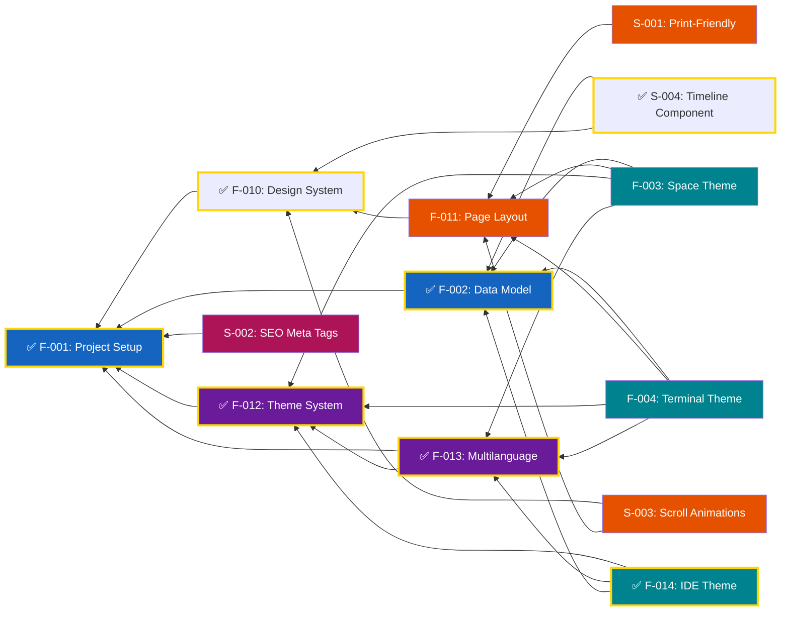

# Feature List

## Features

### Core (Must Have)

- [x] F-001: Project setup — Vite + React + TypeScript scaffold, Tailwind, shadcn/ui, docs
- [x] F-002: Data model — TypeScript types + JSON files for CV content
- [ ] F-003: Space theme — floating panels, parallax depth, scroll-through spatial effect, all CV sections
- [ ] F-004: Terminal theme — CRT green phosphor, scanlines, command-line interaction, `:help`, all CV sections
- [x] F-010: Design system — typography, spacing, colors, component tokens
- [ ] F-011: Page layout — section arrangement, scrolling structure, navigation
- [x] F-012: Theme system — Preact Signals, `createLocalStorageSignal`, theme switcher infrastructure
- [x] F-013: Multilanguage — i18n EN/DE, locale signal, UI translations, CV data per locale
- [x] F-014: IDE theme — file tree sidebar, tab bar, syntax-highlighted editor, status bar, all CV sections

### Should Have

- [ ] S-001: Print-friendly styling — `@media print` so CV doubles as printable resume
- [ ] S-002: SEO meta tags — Open Graph metadata for social media previews
- [ ] S-003: Scroll animations — subtle reveal animations as sections scroll into view
- [~] S-004: Reusable timeline component — shared by all themes with timeline data (implemented in IDE theme as `TimelineSection`, not yet extracted as theme-agnostic)

### Optional

- _TBD_

---

## Implementation Status

| #     | Feature                | Status         | Spec                                    | Implementation | Tests |
| ----- | ---------------------- | -------------- | --------------------------------------- | -------------- | ----- |
| F-001 | Project setup          | ✅ Done        | [spec](../specs/F-001-project-setup.md) | ✅             | ✅    |
| F-002 | Data model             | ✅ Done        | [spec](../specs/F-002-data-model/spec.md) | ✅             | ✅    |
| F-003 | Space theme            | 📋 Planned     | —                                       | ❌             | ❌    |
| F-004 | Terminal theme         | 📋 Planned     | —                                       | ❌             | ❌    |
| F-010 | Design system          | ✅ Done        | [spec](../specs/F-010-design-system/spec.md) | ✅             | ✅    |
| F-011 | Page layout            | 📋 Planned     | —                                       | ❌             | ❌    |
| F-012 | Theme system           | ✅ Done        | —                                       | ✅             | ✅    |
| F-013 | Multilanguage          | ✅ Done        | [spec](../specs/F-013-multilanguage/spec.md) | ✅             | ✅    |
| F-014 | IDE theme              | ✅ Done        | [spec](../specs/F-014-ide-theme/spec.md) | ✅             | ✅    |
| S-001 | Print-friendly styling | 📋 Planned     | —                                       | ❌             | ❌    |
| S-002 | SEO meta tags          | 📋 Planned     | —                                       | ❌             | ❌    |
| S-003 | Scroll animations      | 📋 Planned     | —                                       | ❌             | ❌    |
| S-004 | Reusable timeline      | 🔶 Partial (IDE) | [spec](docs/superpowers/specs/2026-06-21-interactive-timeline-design.md) | ✅ TimelineSection in IDE | ✅ utils |

---

## Workflow

1. **Specification** — Write feature spec in `specs/{feature}.md`
2. **Planning** — Create implementation plan from spec
3. **Implementation** — Write tests first (TDD), then implementation
4. **Review** — Architecture compliance + test coverage
5. **Merge** — Mark feature as implemented in this list

See [docs/Architecture.md](Architecture.md) and [docs/TestingGuide.md](TestingGuide.md) for structure and practices.

---

## Feature Dependencies

The following diagram shows feature dependencies and recommended implementation order:

**Critical Path**: F-001 → F-012 → F-013 → F-002 → F-014 (foundation → theme system → multilanguage → data model → IDE theme, then Space and Terminal themes)
