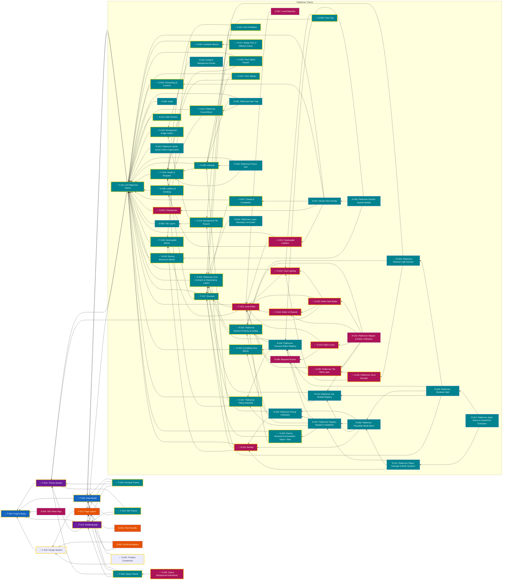

# Feature Dependency Map

Feature ideas and bugs are tracked as GitHub Issues, which are the source of truth for what to build and what is broken. Feature IDs use the work-type prefixes `F-NNN` (core), `S-NNN` (should have), `O-NNN` (optional), and `R-NNN` (refactoring); they appear in issue titles, and dependencies between features are recorded in the issue bodies. This file only holds the dependency map.

## Feature Dependencies

The following diagram shows feature dependencies and recommended implementation order:

**Critical Path**: F-001 → F-012 → F-013 → F-002 → F-014 (foundation → theme system → multilanguage → data model → IDE theme, then Space and Terminal themes)
