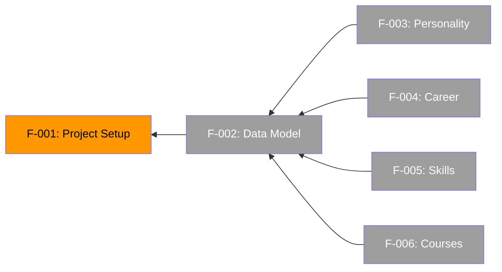

# Feature List

## Features

### Core (Must Have)

- [ ] F-001: Project setup — Vite + React + TypeScript scaffold, Tailwind, shadcn/ui, docs
- [ ] F-002: Data model — TypeScript types + JSON files for CV content
- [ ] F-003: Display personality section — name, tagline, summary
- [ ] F-004: Display career timeline — company, role, period, highlights
- [ ] F-005: Display skills — categories with visual skill levels
- [ ] F-006: Display courses — title, provider, year

### Should Have

- _TBD after layout decisions_

### Optional

- _TBD_

---

## Implementation Status

| # | Feature | Status | Spec | Implementation | Tests |
| - | ------- | ------ | ---- | -------------- | ----- |
| F-001 | Project setup | 🔄 In Progress | [spec](../specs/2026-06-20-project-scaffold-design.md) | ❌ | ❌ |
| F-002 | Data model | 📋 Planned | — | ❌ | ❌ |
| F-003 | Personality section | 📋 Planned | — | ❌ | ❌ |
| F-004 | Career timeline | 📋 Planned | — | ❌ | ❌ |
| F-005 | Skills display | 📋 Planned | — | ❌ | ❌ |
| F-006 | Courses display | 📋 Planned | — | ❌ | ❌ |

---

## Workflow

1. **Specification** — Write feature spec in `specs/{feature}.md`
2. **Planning** — Create implementation plan from spec
3. **Implementation** — Write tests first (TDD), then implementation
4. **Review** — Architecture compliance + test coverage
5. **Merge** — Mark feature as implemented in this list

See [docs/Architecture.md](Architecture.md) and [docs/TestingGuide.md](TestingGuide.md) for structure and practices.

---

## Feature Dependencies

The following diagram shows feature dependencies and recommended implementation order:

**Critical Path**: F-001 → F-002 → F-003 (personality section drives the base layout pattern that F-004/F-005/F-006 follow)
