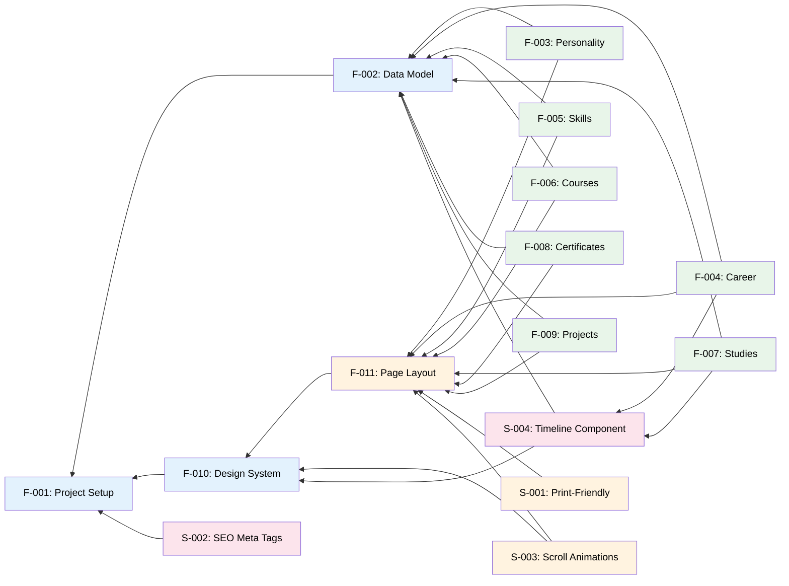

# Feature List

## Features

### Core (Must Have)

- [ ] F-001: Project setup — Vite + React + TypeScript scaffold, Tailwind, shadcn/ui, docs
- [ ] F-002: Data model — TypeScript types + JSON files for CV content
- [ ] F-003: Display personality section — name, tagline, summary
- [ ] F-004: Display career timeline — company, role, period, highlights
- [ ] F-005: Display skills — categories with visual skill levels
- [ ] F-006: Display courses — title, provider, year
- [ ] F-007: Display studies / education — degree, institution, period
- [ ] F-008: Display certificates — name, issuer, date
- [ ] F-009: Display personal projects — name, description, tech stack, link
- [ ] F-010: Design system — typography, spacing, colors, component tokens
- [ ] F-011: Page layout — section arrangement, scrolling structure, navigation

### Should Have

- [ ] S-001: Print-friendly styling — `@media print` so CV doubles as printable resume
- [ ] S-002: SEO meta tags — Open Graph metadata for social media previews
- [ ] S-003: Scroll animations — subtle reveal animations as sections scroll into view
- [ ] S-004: Reusable timeline component — shared by Career (F-004) and Studies (F-007)

### Optional

- _TBD_

---

## Implementation Status

| # | Feature | Status | Spec | Implementation | Tests |
| - | ------- | ------ | ---- | -------------- | ----- |
| F-001 | Project setup | 🔄 In Progress | [spec](../specs/2026-06-20-project-scaffold-design.md) | ❌ | ❌ |
| F-002 | Data model | 📋 Planned | — | ❌ | ❌ |
| F-003 | Personality section | 📋 Planned | — | ❌ | ❌ |
| F-004 | Career timeline | 📋 Planned | — | ❌ | ❌ |
| F-005 | Skills display | 📋 Planned | — | ❌ | ❌ |
| F-006 | Courses display | 📋 Planned | — | ❌ | ❌ |
| F-007 | Studies / education | 📋 Planned | — | ❌ | ❌ |
| F-008 | Certificates display | 📋 Planned | — | ❌ | ❌ |
| F-009 | Personal projects | 📋 Planned | — | ❌ | ❌ |
| F-010 | Design system | 📋 Planned | — | ❌ | ❌ |
| F-011 | Page layout | 📋 Planned | — | ❌ | ❌ |
| S-001 | Print-friendly styling | 📋 Planned | — | ❌ | ❌ |
| S-002 | SEO meta tags | 📋 Planned | — | ❌ | ❌ |
| S-003 | Scroll animations | 📋 Planned | — | ❌ | ❌ |
| S-004 | Reusable timeline | 📋 Planned | — | ❌ | ❌ |

---

## Workflow

1. **Specification** — Write feature spec in `specs/{feature}.md`
2. **Planning** — Create implementation plan from spec
3. **Implementation** — Write tests first (TDD), then implementation
4. **Review** — Architecture compliance + test coverage
5. **Merge** — Mark feature as implemented in this list

See [docs/Architecture.md](Architecture.md) and [docs/TestingGuide.md](TestingGuide.md) for structure and practices.

---

## Feature Dependencies

The following diagram shows feature dependencies and recommended implementation order:

**Critical Path**: F-001 → F-010 → F-011 → F-002 → F-003 (foundation → design system → layout → data model → first content section drives reusable patterns for F-004 through F-009)
