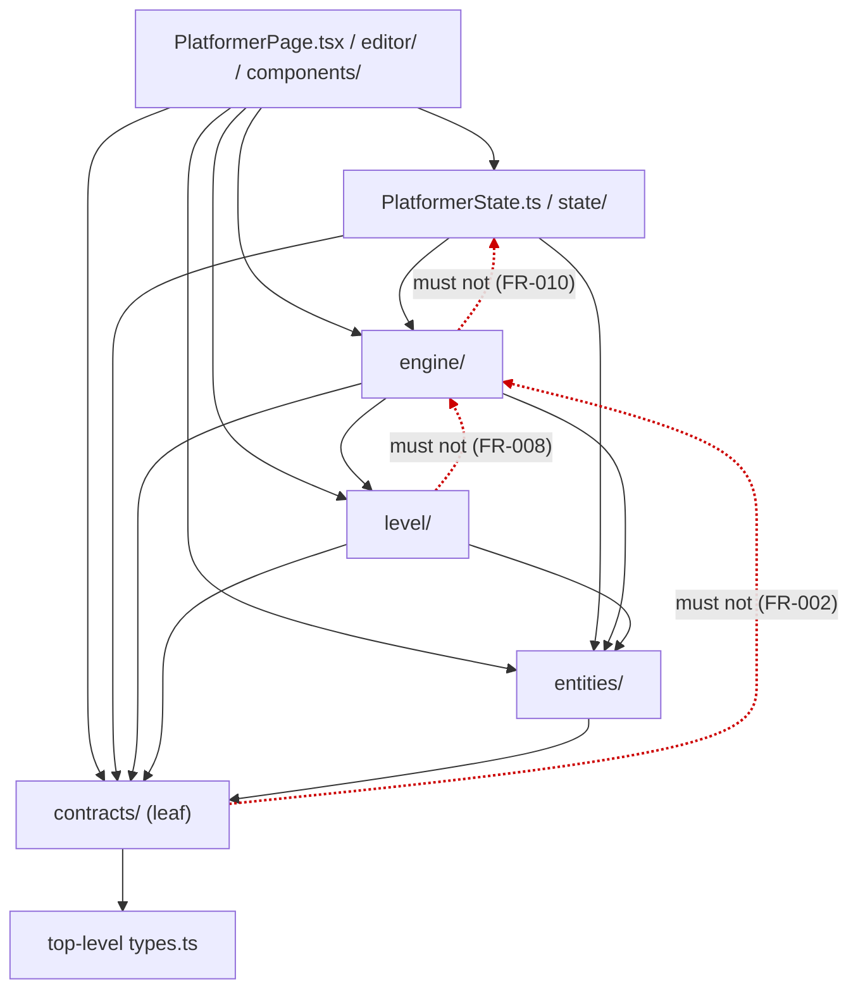

# Contract — Platformer Layer Boundaries

**Feature**: R-001 | **Date**: 2026-09-24

This feature's externally observable contract is an **import-direction
contract** between the platformer theme's folders. The project has no public
API, so the contract is expressed as allowed import edges plus the exact check
used to verify them (the one-time manual inspection the spec clarification
chose). It is the acceptance contract for SC-001 / SC-002.

---

## 1. Allowed import edges

### Dependency graph

Solid arrows are the only permitted import directions after R-001; dotted red
arrows are the forbidden edges the contract exists to prevent (SC-001). This
block can be pasted verbatim into the GitHub issue or PR body.



### ASCII fallback

```text
                    ┌──────────────────────────────────────────────┐
                    │  PlatformerPage.tsx / editor/ / components/  │
                    └───────────────┬──────────────────────────────┘
                                    │ (may import anything below)
                    ┌───────────────▼──────────────┐
                    │  PlatformerState.ts / state/ │
                    └───────────────┬──────────────┘
                                    │
              ┌─────────────────────┼─────────────────────┐
              ▼                     ▼                     ▼
        ┌──────────┐          ┌──────────┐          ┌──────────┐
        │ engine/  │─────────►│  level/  │          │ entities/│
        └────┬─────┘          └────┬─────┘◄─────────┴────┬─────┘
             │                     │                     │
             └──────────┬──────────┴─────────────────────┘
                        ▼
                   ┌────────────┐        top-level types.ts
                   │ contracts/ │◄──────────────┘
                   └────────────┘
```

### Must-hold edges (after R-001)

| Source      | May import                                                     |
| ----------- | -------------------------------------------------------------- |
| `contracts/`     | `contracts/**`, `../types` only                                     |
| `level/`    | `contracts/`, `entities/`, `level/`, `../types`                     |
| `entities/` | `contracts/`, `level/`, `entities/`, `../types`                     |
| `engine/`   | `contracts/`, `level/`, `entities/`, `engine/`                      |
| `state/`    | any of the above + `PlatformerState`                           |

### Forbidden edges (the contract)

- `contracts/` → `engine/`, `entities/`, `level/`, `state/`, `editor/`, `components/`, `PlatformerState`, `PlatformerPage` — **none, including `import type`** (FR-002).
- `level/` → `engine/` — **none** (FR-008).
- `engine/` → `state/` or `PlatformerState` — **none** (FR-010).
- `contracts/` → `entities/blocks/potTypes.ts` — avoided by the `DrawContext<TPotPlan>` decoupling (research §1d).

`types.ts`'s own `import type { EnemyTypeKey } from './entities/enemies'` is
the sanctioned shared-type edge and is erased at build time; it is not a
`contracts/` import.

---

## 2. Contracts public surface (must remain stable for importers)

The `contracts/` modules export exactly the symbols listed in
[data-model.md §2.1–2.2](../data-model.md). Importing modules change only the
path they import from — not the symbol names, shapes, or values.

| Module                  | Exports (unchanged shapes)                                                       |
| ----------------------- | -------------------------------------------------------------------------------- |
| `contracts/WorldType.ts`     | `WorldType<S>`, `Boxed<S>`                                                        |
| `contracts/capabilities.ts`  | `Moving`, `SelfAnimated`, `Damageable`, `DamageableType<S>`, `isInvulnerable`     |
| `contracts/geometry.ts`      | `Direction`, `Rect`, `Box`                                                        |
| `contracts/Outcome.ts`       | `PlayerEffects`, `RewardEffects`, `strongerBounce`                                |
| `contracts/Contact.ts`       | `ContactSide`, `Contact`, `CollisionOutcome<S>`                                   |
| `contracts/DrawContext.ts`   | `DrawContext<TPotPlan = unknown>` (field `potPlan?: TPotPlan`)                    |
| `contracts/PhysicsConfig.ts` | `PHYSICS_CONFIG` (same values)                                                    |
| `contracts/SpriteLookup.ts`  | `SpriteLookup`                                                                    |
| `contracts/PickupKind.ts`    | `PickupKind`                                                                      |
| `contracts/counters.ts`      | `CounterKey`, `CounterPopupLabelKey`                                              |

---

## 3. Verification (SC-001 inspection)

Run from the repo root after implementation. Each command must print **no
matches** except where noted:

```powershell
# I1 — contracts/ imports nothing above it (only ../types is allowed)
rg "from '(\.\./)+((engine|entities|level|state|editor|components)/|PlatformerState|PlatformerPage)" src/themes/platformer/contracts

# I2 — no level/ → engine/ edge
rg "from '(\.\./)?engine/" src/themes/platformer/level

# I3 — no engine/ → state edge
rg "PlatformerState|from '.*state/" src/themes/platformer/engine

# I4 — no legacy paths still required (spot-check the old importers)
rg "engine/(Outcome|Contact|DrawContext|PhysicsConfig|Torch|RewardReveal)" src/themes/platformer
rg "entities/(WorldType|capabilities|geometry)" src/themes/platformer
```

Interpretation:

- I1–I3 must be empty.
- I4 may match **comments** (e.g. doc references to `RewardReveal.ts`) but must
  not match any `import … from` statement. Review the output manually.

The same inspection is described step-by-step, alongside the test/build/browser
checks, in [quickstart.md](../quickstart.md).
