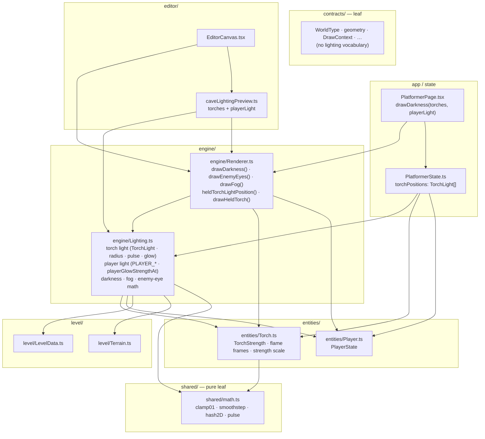
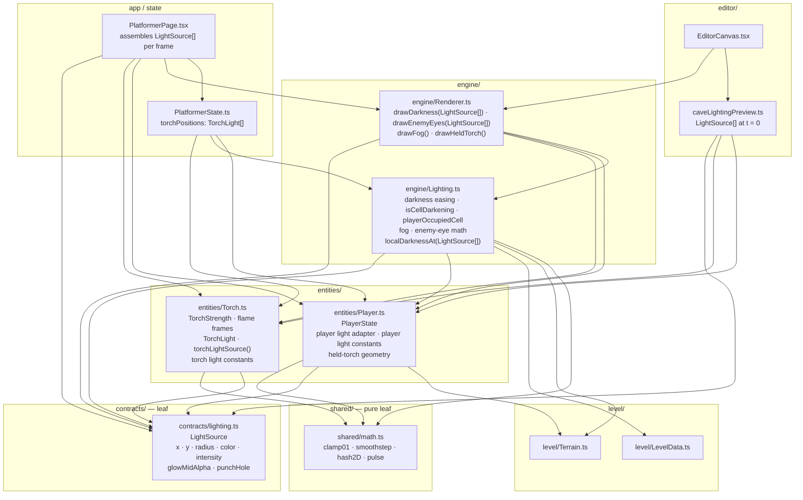

# Light Dependency Map — R-003 Platformer Abstract Light Sources

**Feature**: [`spec.md`](./spec.md) · **Branch**: `R-003-platformer-abstract-light-sources`

This document shows which files take part in the platformer lighting model and how they
depend on one another: first as the code is **today**, then as the spec intends it **after
R-003**. Arrows are imports (`A --> B` means A imports B). It is a reference for the plan /
tasks; the spec's FRs remain the source of truth.

> **Status:** spec only — the target graph is *not yet implemented*. The source tree is still
> in the "current" shape below.

## Before R-003 (current)

Lighting logic is split by accident of history: `engine/Lighting.ts` owns **both** the torch
light half and the player light half, `engine/Renderer.ts` owns the player light position and
all four draw passes, and the entity modules carry no light code at all.

## After R-003 (target)

One `LightSource` contract in `contracts/lighting.ts`; each light lives with its subject
(torch half → `entities/Torch.ts`, player half → `entities/Player.ts`); the draw passes take a
single `readonly LightSource[]`; `engine/Lighting.ts` keeps only the non-light-kind math.

In the target graph, `contracts/lighting.ts` is new; `entities/Torch.ts` and `entities/Player.ts`
gain the moved light code (the tables below spell out exactly what moves).

## What moves, in one table

| Light piece | Today | After R-003 |
| --- | --- | --- |
| `LightSource` type | — | **`contracts/lighting.ts`** (new leaf) |
| `TorchLight` descriptor + torch light radius/pulse/glow (`torchLightRadius`, `torchPulseScale`, `torchGlowStrengthAt`, `TORCH_*`) | `engine/Lighting.ts` | **`entities/Torch.ts`** (X5) |
| `torchLightSource(torch, worldElapsed)` adapter | — | **`entities/Torch.ts`** |
| Player light constants (`PLAYER_LIGHT_RADIUS_PX`, `PLAYER_GLOW_COLOR`, `PLAYER_GLOW_INTENSITY`) + `playerGlowStrengthAt` | `engine/Lighting.ts` | **`entities/Player.ts`** |
| `heldTorchLightPosition` (+ held-torch geometry) | `engine/Renderer.ts` | **`entities/Player.ts`** (player `LightSource` adapter) |
| `drawDarkness` / `drawEnemyEyes` light inputs | `torches` + `playerLight` | one `readonly LightSource[]` |
| `localDarknessAt` | torch/player kind max | max over `LightSource[]` |
| `drawDarkness` / `localDarknessAt` `worldElapsed` | used | dropped (radius resolved by adapters) |
| `caveLightingPreview` result | `{ darknessLevel, torches, playerLight }` | `{ darknessLevel, lights: LightSource[] }` (t = 0) |
| `torchPositions` signal | `TorchLight[]` (type from `engine/Lighting`) | `TorchLight[]` (type from `entities/Torch`) |

**Edges that disappear:** `engine/Lighting.ts → entities/Torch.ts` (the torch formula no longer
lives there) and `engine/Renderer.ts` owning the player light. **Edges that appear:**
`entities/Torch.ts → contracts/lighting.ts`, `entities/Player.ts → contracts/lighting.ts`,
`engine/Lighting.ts → contracts/lighting.ts`, and the app/editor consumers →
`entities/Torch.ts` / `entities/Player.ts` adapters.

## Layer invariants the graph must keep (R-001)

- `contracts/lighting.ts` and `shared/math.ts` are leaves — they import nothing upward.
- No `entities/ → engine/` edge: this is why the player light half must move *into*
  `entities/Player.ts` rather than stay in `engine/Lighting.ts` (FR-010).
- No `level/ → engine/`; no `engine/ → state`.
- `engine/Lighting.ts` stays pure and DOM-free.
